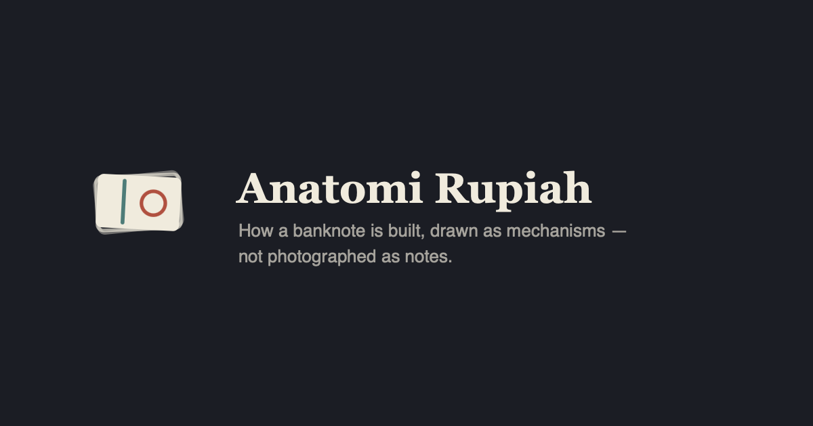

<div align="center">



### Anatomi Rupiah

**How a banknote is built — drawn as mechanisms rather than photographed as notes.**
*Dilihat · Diraba · Diterawang*

[**→ Open the site**](https://andifathulms.github.io/anatomi-rupiah/)

[](https://github.com/andifathulms/anatomi-rupiah/actions/workflows/deploy.yml)
[](LICENSE)
[](LICENSE)
[](#what-it-refuses-to-do)

</div>

---

Bank Indonesia teaches the **3D method** — *dilihat, diraba, diterawang* — because
recognising a genuine note still depends on ordinary people. Almost every
Indonesian can recite the three words. Far fewer could say what a watermark
physically *is*, why intaglio printing feels raised, or what the security thread
is doing inside the paper.

Existing material shows you *what to look for* and never *why it works*. A
photograph of a watermark is a grey patch. A cross-section of how thickness
variation modulates transmitted light is an explanation — and that stays learned.

## What's in it

| | |
|---|---|
| **The sheet** | Ten denominations as schematics with feature markers, and a loupe that opens beside the drawing rather than over it |
| **Eight mechanisms** | Watermark, security thread, rectoverso, intaglio, colour-shift, microtext, UV, and the blind code — each drawn in cross-section |
| **The 3D walkthrough** | The three checks in BI's own framing, ending honestly at *diraba* |
| **Kode tuna netra** | The raised marks that identify a denomination by touch, per note. Almost no sighted Indonesian knows they exist |
| **Figures & motifs** | The hero on the front; the dance, landscape, and flower on the back |
| **Live optics** | WebGL shaders computing thin-film interference, transmission through varying thickness, and raking light across relief |

## What it refuses to do

This is the part that shapes everything else.

- **No authenticity verdict.** No scanner, no camera, no upload, no comparison,
  no score. Bank Indonesia determines whether Rupiah is genuine — this site
  teaches features and says who decides.
- **No photographs of banknotes.** Not one, anywhere in the repository. All note
  artwork is original authored SVG.
- **No downloadable note image**, at any resolution. Sharing exports the
  *mechanism diagram* only.
- **No counterfeiting-relevant detail.** Explainers describe what a genuine
  feature does and what to observe — never ink chemistry, substrate
  composition, process parameters, or how a fake might approximate one.
- **No network at runtime.** No font CDN, no analytics, no remote assets. Fonts
  are self-hosted at build time.
- **The touch limit is stated, never simulated.** No haptics, no texture
  animation. *Diraba tidak bisa lewat layar. Ambil uangnya.*

## Legal position

The site depicts Rupiah, and relies on the educational exemption in
**UU 7/2011 Pasal 24 ayat (1)**, which permits imitating Rupiah for educational
purposes **with the word *spesimen* applied**. Violation carries up to a year
and a Rp200 million fine — the one risk here with a criminal penalty attached.

So:

- **SPESIMEN is baked into the artwork**, authored as path geometry in the same
  coordinate space as the note outline, produced by the same call. It survives
  screenshots and cannot be removed by hiding an element or disabling a
  stylesheet. There is no API that returns an unmarked outline.
- **Schematics are never photorealistic and never near actual size** — capped
  below 70% of real banknote dimensions, asserted every build.
- **Pasal 24 ayat (2)** separately prohibits circulating *Rupiah Tiruan*, with no
  educational carve-out, which is why no export path emits a note.

No published Bank Indonesia rule on reproduction size was found; the project
adopts the stricter conditions other central banks specify rather than assume
none apply. The search, the finding, and the reasoning are recorded in
[`docs/bi-reproduction-guidance.md`](docs/bi-reproduction-guidance.md), and a
drafted enquiry to BI is in
[`docs/surat-bank-indonesia.md`](docs/surat-bank-indonesia.md).

Not affiliated with Bank Indonesia. No government branding. Nothing here should
be read as official issuance or endorsement.

## The compliance gate

Unusually, most of the test suite is legal compliance — which is right, because
that is where the real risk sits. `pnpm compliance:check` gates the build and
CI. It is never bypassed, never given a skip flag, and no assertion in it is
weakened to make something pass.

| Check | What it asserts |
|---|---|
| `asset-policy` | No raster imagery in the repository, except brand assets pinned by SHA-256 |
| `spesimen-presence` | Every schematic and loupe, rendered through `react-dom/server`, carries baked mark geometry with an inline stroke |
| `size-constraint` | No schematic renders at or near actual banknote dimensions |
| `loupe-region` | A magnified detail is strictly smaller than a note, so details cannot assemble into one |
| `anatomy-marking` | The 3D hero is marked, and under the cap both as drawn *and* after perspective magnification |
| `export-surface` | Only mechanism diagrams and brand assets are publishable; nothing bearing note artwork |
| `source-policy` | No canvas capture, pixel readback, camera, file upload, socket, fetch, or font CDN in shipped source |
| `marking-implementation` | The mark is never a pseudo-element or a positioned layer |
| `dependencies` | No imaging, camera, or ML packages |

Every check is exercised in tests against input it must **reject** as well as
input it must accept — a gate nobody has watched fail is not a gate.

Separately, `pnpm content:validate` enforces that **every claim carries a
citation** a reader can follow, and screens prose in both languages for the
manufacturing register and for authenticity-verdict language.

## Getting started

```bash
pnpm install
pnpm dev
```

| Command | |
|---|---|
| `pnpm dev` | Development server |
| `pnpm build` | Compliance + content gates, then static export to `./out` |
| `pnpm preview` | Serve `./out` under the production `basePath` |
| `pnpm test:run` | Unit and compliance tests |
| `pnpm compliance:check` | The gate above |
| `pnpm content:validate` | Citation completeness and register screen |
| `pnpm typecheck` / `pnpm lint` | TypeScript `strict`, no `any`, no non-null assertions |

Before a release, work through
[`docs/content-review-checklist.md`](docs/content-review-checklist.md). The §4
pass — *does this sentence help someone check a note, or make one?* — is a
person's job, not the validator's.

## How it's built

Next.js 14 App Router, `output: 'export'`. TypeScript strict. Tailwind. Zod for
content. Vitest. No backend, no database, no runtime network. First load is
~87 kB of JS against a 200 kB budget — including the WebGL, which is hand-written
rather than three.js precisely to stay inside it.

```
data (cited)  →  content schema  →  view models  →  components
                                          ↓
art/mechanisms (authored SVG)  →  mechanism figures
lib/spesimen (baked marking)   →  lib/schematic  →  the sheet, the loupe
lib/webgl (shaders)            →  live optics panels
```

| Directory | |
|---|---|
| `app/[locale]/` | Routes. Indonesian default, English at `/en` |
| `lib/spesimen/` | The Pasal 24 marking, as geometry. Never an overlay |
| `lib/schematic/` | Outline geometry, the size constraint, the loupe |
| `lib/webgl/` | Shaders and a ~4 kB quad runner |
| `lib/compliance/` | The checks, shared by the script and the tests |
| `art/mechanisms/` | Authored SVG cross-sections |
| `data/` | Features, denominations, figures, motifs — all cited |
| `docs/` | Legal research, review checklist, BI enquiry draft |

## Sources

Rupiah-specific claims cite Bank Indonesia: the per-denomination *Peraturan Bank
Indonesia* for Tahun Emisi 2022 (24/8–24/14/PBI/2022), which enumerate each
note's *ciri* article by article, and BI's *Gambar Uang* catalogue. The optics
cite Hecht's *Optics* and van Renesse's *Optical Document Security*. Blind-code
counts cite Pertuni, the association BI consulted. Biographies cite the
*Ensiklopedi Pahlawan Nasional* (1995).

Where no citable source was found, the gap is stated on the page rather than
filled in. Two biographies are unwritten for exactly this reason.

## Licence

Code **MIT**; artwork and written content **CC BY-NC-SA 4.0**. The asymmetry is
deliberate and [`LICENSE`](LICENSE) explains it: the schematics exist under an
exemption attached to the *purpose* of use, so a permissive licence on the
artwork would invite reuse this project cannot vouch for. Nothing in the licence
grants any right in respect of Rupiah itself.

<div align="center">
<sub>Designed & built by <a href="https://andifathulms.github.io/en/">Andi Fathul Mukminin</a></sub>
</div>
